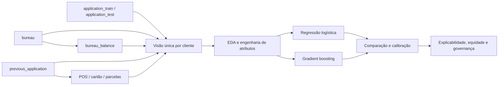

# Análise de Risco de Crédito — Home Credit

[](https://www.python.org/)
[](https://colab.research.google.com/)
[](#qualidade-e-validação)
[](#uso-responsável)

> Da base crua à decisão: um projeto end-to-end que transforma histórico de crédito em uma análise explicável, auditável e pronta para ser apresentada.

Este projeto responde a uma pergunta simples de escrever e difícil de resolver: **como estimar risco de inadimplência sem transformar o modelo em uma caixa-preta?** A solução percorre auditoria de dados, análise exploratória, engenharia de atributos, comparação de modelos, definição de limiar, explicabilidade, equidade e governança.

O trabalho foi construído em PT-BR como uma apresentação executiva executável no Google Colab. Cada linha de código possui um comentário narrativo imediatamente antes dela — o código calcula, mas também conta a história.

## Visão rápida para recrutadores

| Dimensão | O que o projeto demonstra |
|---|---|
| Negócio | Tradução de probabilidades em uma política de decisão com custos ilustrativos |
| Dados | Auditoria de 10 tabelas relacionais e consolidação em uma linha por cliente |
| Modelagem | Comparação entre regressão logística e gradient boosting sem vazamento do alvo |
| Avaliação | ROC AUC, PR AUC, KS, Brier, precisão, sensibilidade e F1 |
| Responsabilidade | Explicabilidade, auditoria por gênero, limitações e plano de monitoramento |
| Engenharia | Notebook autocontido, testes estruturais, smoke test e artefatos reproduzíveis |

**Entrega principal:** [`notebooks/Projeto_Analise_Risco_Credito_Home_Credit.ipynb`](notebooks/Projeto_Analise_Risco_Credito_Home_Credit.ipynb)

## Arquitetura analítica



Todas as tabelas históricas são agregadas por `SK_ID_CURR`. O `TARGET` fica fora da engenharia de atributos e o conjunto de teste interno só participa da avaliação final.

## Etapas do projeto

1. validação do ZIP, inventário, chaves e granularidade;
2. análise exploratória orientada a risco e qualidade;
3. criação de atributos de aplicação, bureau, propostas, POS/CASH, cartão e parcelas;
4. separação estratificada em treino, validação e teste interno;
5. comparação de um baseline interpretável com gradient boosting;
6. escolha do limiar por custo ilustrativo somente na validação;
7. avaliação final com métricas adequadas a classes desbalanceadas;
8. importância por permutação, auditoria de equidade e exportação dos artefatos.

Cada etapa contém um portão programático com a pergunta **“Dá para melhorar?”**. A execução só avança quando os critérios daquela fase são atendidos. Sim, o notebook também faz revisão de qualidade — ele só não marca reunião para falar sobre a reunião.

## Qualidade e validação

O validador estrutural confirma:

- 35 células no notebook;
- 23 células de código compiladas;
- 794 linhas executáveis com comentário narrativo;
- presença dos componentes obrigatórios de dados, modelagem e governança;
- ausência de caminhos locais do autor no notebook.

Um smoke test local executou o fluxo de ponta a ponta com os sete CSVs íntegros recuperados do download parcial. Nesse cenário técnico, o modelo selecionado foi gradient boosting, com **ROC AUC 0,751**, **KS 0,381** e **Brier 0,069** no teste interno.

> Esses números validam o funcionamento do pipeline, não representam um resultado final da competição: três arquivos do conjunto completo estavam ausentes. A limitação é declarada para evitar uma precisão de vitrine — bonita, mas enganosa.

Para rodar somente a validação estrutural:

```bash
python tests/validar_notebook.py
```

## Como executar no Google Colab

1. Baixe o conjunto completo na [página oficial da competição](https://www.kaggle.com/competitions/home-credit-default-risk/data).
2. Envie `homecredit.zip` para o Google Drive.
3. Abra o notebook principal no Colab.
4. Na primeira célula de configuração, troque `USAR_GOOGLE_DRIVE = False` para `True`.
5. Ajuste `CAMINHO_ZIP` se o arquivo não estiver na raiz de `Meu Drive`.
6. Execute as células em ordem.

O modo padrão é `completo` e exige todos os CSVs. Para validar mais rapidamente a etapa de modelagem, use `MODO_EXECUCAO = "rapido"`; as agregações históricas continuam considerando todos os registros disponíveis.

## Estrutura do repositório

```text
.
├── .github/workflows/                # validação automática
├── dados/
│   └── README.md                     # instruções para obter a base
├── notebooks/
│   └── Projeto_Analise_Risco_Credito_Home_Credit.ipynb
├── relatorios/
│   └── auditoria_dados_recuperados.json
├── scripts/
│   ├── auditar_dados.py
│   ├── construir_notebook.py
│   ├── empacotar_projeto.py
│   └── recuperar_zip_parcial.py
├── tests/
│   ├── executar_smoke_notebook.py
│   ├── gerar_dados_sinteticos.py
│   └── validar_notebook.py
├── requirements-colab.txt
└── README.md
```

Os dados brutos, modelos treinados e resultados locais ficam fora do Git. O repositório publica código, documentação e evidências leves — não redistribui os dados da competição.

## Artefatos produzidos

- `modelo_risco_credito.joblib`;
- `submissao_home_credit.csv`;
- `comparacao_modelos.csv`;
- `tabela_decis.csv`;
- `importancia_variaveis.csv`;
- `auditoria_genero.csv`;
- `manifesto_modelo.json`.

## Uso responsável

Este projeto é educacional e **não constitui recomendação de concessão de crédito**. O limiar usa uma razão de custos ilustrativa. Uso em produção exigiria base legal, validação independente, análise de impacto, calibração econômica, monitoramento de deriva e revisão humana.

---

Feito por [Guilherme Bezerra](https://github.com/GuilhermeBezerra0212) — porque um bom modelo precisa explicar o risco, e um bom portfólio precisa explicar o modelo.

